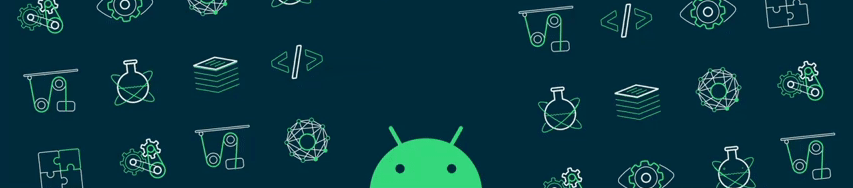

<!------------------------------------------------------------------------------------------------------------------------------------------------------------------------------------------------------------------------------------------------->

<!------------------------------------------------------------------------------------------------------------------------------------------------------------------------------------------------------------------------------------------------->
<h1 align=center>  Hi, @DebjeetBanerjee here aka mintRaven </h1>
<!------------------------------------------------------------------------------------------------------------------------------------------------------------------------------------------------------------------------------------------------->

  
  &nbsp;&nbsp;&nbsp;
   
  &nbsp;&nbsp;&nbsp;
  

  <!------------------------------------------------------------------------------------------------------------------------------------------------------------------------------------------------------------------------------------------------->
 
 
<!------------------------------------------------------------------------------------------------------------------------------------------------------------------------------------------------------------------------------------------------->

<strong><samp>「</samp></strong>
 
  

    <samp>
        <b>
   I've always been a person who if I didn't know how to make something,  I'd find out how, so programming has been a perfect fit. 
🎓 I am pursuing my bachelor's degree in Computer Science Engineering  Currently open to any project collaborations, so feel free to reach me anytime.
      </b>
        
        <image src="https://readme-typing-svg.herokuapp.com?font=Iosevka&size=16&color=97a4e2&center=true&width=410&height=45&repeat=false&lines=I+use+'Arch'+BTW.">
    </samp>
  

<strong><samp>」</samp></strong>

 

<!------------------------------------------------------------------------------------------------------------------------------------------------------------------------------------------------------------------------------------------------->
<h1 align=center></h1>

  

&nbsp;&nbsp;&nbsp;&nbsp;&nbsp;&nbsp;&nbsp;&nbsp;&nbsp;
 

&nbsp;&nbsp;&nbsp;&nbsp;&nbsp;&nbsp;&nbsp;&nbsp;&nbsp;&nbsp;&nbsp;&nbsp;&nbsp;&nbsp;&nbsp;&nbsp;&nbsp;&nbsp;&nbsp;&nbsp;&nbsp;&nbsp;&nbsp;&nbsp;&nbsp;&nbsp;&nbsp;&nbsp;&nbsp;&nbsp;&nbsp;&nbsp;&nbsp;&nbsp;&nbsp;&nbsp;&nbsp;&nbsp;&nbsp;&nbsp;&nbsp;&nbsp;&nbsp;&nbsp;&nbsp;&nbsp;&nbsp; 
<!------------------------------------------------------------------------------------------------------------------------------------------------------------------------------------------------------------------------------------------------->
<h2 align=center> Tech Stack </h2>

              <a href="https://flask.palletsprojects.com/" target="_blank" rel="noreferrer">            <a href="https://nextjs.org/" target="_blank" rel="noreferrer">           

<h1></h1>
<!------------------------------------------------------------------------------------------------------------------------------------------------------------------------------------------------------------------------------------------------->

[linkedin]: https://www.linkedin.com/in/~debjeetbanerjee/
[medium]: https://medium.com/@debjeetbanerjee48
[gmail]:mailto:debjeetbanerjee48@gmail.com
<!------------------------------------------------------------------------------------------------------------------------------------------------------------------------------------------------------------------------------------------------->
